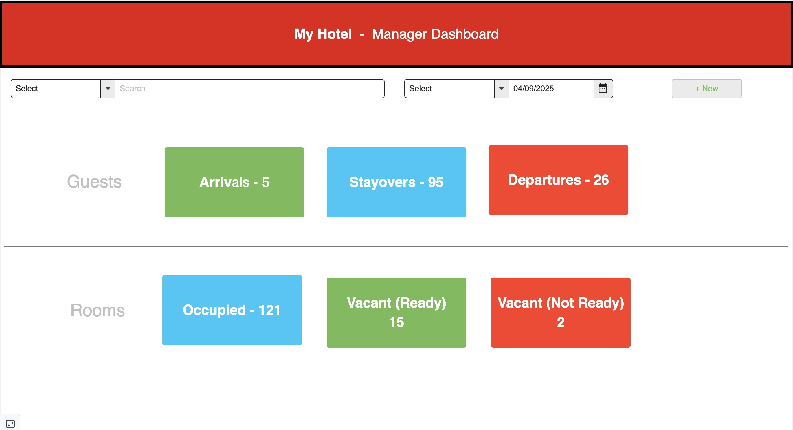

<h1>CS 408 - Final Project</h1>
<h3>By Austin Andersen</h3>

 

<h2>General Theme</h2>

My idea for the project is to create an application that would be used in hotels by front desk staff, as I am a night auditor myself at a hotel. I've been intending on making some sort of application that is 
  better than what we currently use. I've been talking previously to a coworker of mine about taking on a project like this to see if I can make a website that has better features, and to improve upon existing ones.
  While I might not be able to make a fully functioning application the way that I want to, I thought that with the project specifications of making a workable website that integrates AWS, I could at least make a
  dumbed down version, and try my hand at it.

<h2>Features</h2>

The base features that I want to include is that I want to be able to store guest information on my database. I want to be able to access guest information, and to "check-out" guests by either deleting them 
  from the database altogether, or having some sort of flag on these reservations that indicates whether they are incoming arrivals, currently checked-in, or past guests. If I have time and am able to do so, I
  would also like to add some additional features, such as a bulk checkout. This feature in the current application I use is implmented incorrectly, and doesn't allow you to select what guests specifically you 
  would like to check out. Instead, it makes you check out everyone, which obviously is not useful and any situation.

  <h2>Target Audience</h2>
  
The target audience for this website would be hotel staff who use this application.

  <h2>Data to be Used</h2>
  
Data that will be stored in my database will include first and last names, phone numbers, emails, check-in and check-out dates, reservation notes, and potentially a list of room charges. If you are looking
    for check-outs, it will pull any reservations with departure date on the current date. If you are looking for check-ins, it will do the same thing, looking at arrival date. If I'm able to implement it in time,
    I would like to be able to arrange room charges and create an invoice that can be sent out to the guest.

  <h2>Additional Features</h2>
  
As I said, I would like to make sure that I can get the check-in and check-out feature to work. If I am able to, I want to add the bulk checkout feature, a feature to create a personalized invoice, and a search
    feature.

<h2>Website wireframe</h2>

